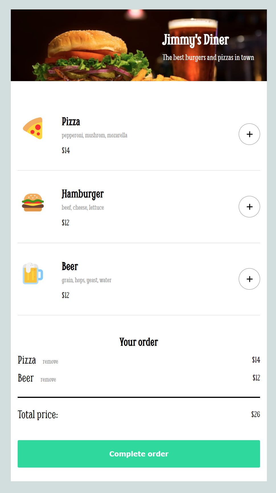

# Restaurant Mobile Ordering App

This is a functional mockup of a restaurant mobile ordering app built with vanilla JavaScript, part of the Scrimba Frontend Engineer Career Path curriculum. Design by Scrimba.

## Table of contents

- [Overview](#overview)
  - [The challenge](#the-challenge)
  - [Screenshot](#screenshot)
  - [Future enhancements](#future-enhancements)
  - [Links](#links)
- [My process](#my-process)
  - [Built with](#built-with)
- [Author](#author)

## Overview

### The challenge

Users should be able to:

- Add and remove menu items from their order  
- See a payment modal with form inputs to complete order
- Receive an order complete/confirmation message
- See order confirmation disappear after 3 secs, reseting ordering form

### Screenshot

### Future Enhancements

- Change theme of app (type of products)
- Offer combo discount (15% off certain items purchased together)
- Prompt user for experience rating after purchase

### Links

- Live Site URL: [Netlify-hosted demo site](https://endearing-creponne-b82df2.netlify.app/)

## My process

### Built with

- JavaScript
- Flexbox
- HTML5

## Author

- GitHub - [mattpahuta](https://github.com/mattpahuta)
- Twitter - [@MattPahuta](https://twitter.com/MattPahuta)